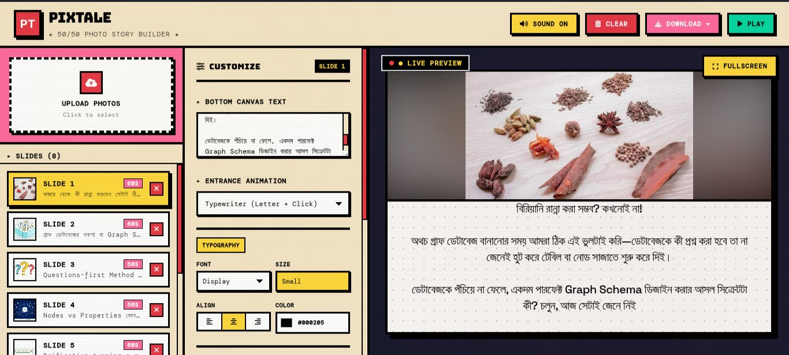
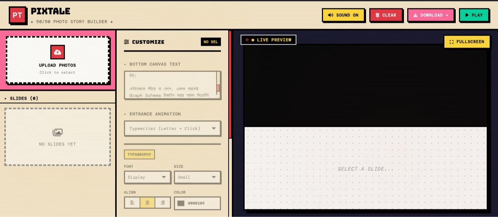

# PixTale 📸✨

> **Where pictures tell a story with sound and motion.**

**PixTale** is a lightweight, modern web-based presentation and visual storytelling tool designed to cut down the hassle of traditional video editing and slide creation. Built for creators, students, and developers who want to showcase their projects, tech journeys, or ideas instantly without dealing with complex layout or audio-syncing issues.

---

## 🚀 Why PixTale?

Ever spent hours aligning slide layouts, hunting for sound effects, and tweaking text animations just for a 30-second teaser? **PixTale** solves this by providing:
* **50/50 Split Layouts:** Clean, balanced visual hierarchy for images and text.
* **Auto-Image Fitting:** Smart image scaling logic (`object-contain`) to prevent cropping or stretching.
* **Typewriter & Audio Effects:** Live typing text animations paired with synchronized audio cues to bring stills to life.
* **Custom File Support:** Designed with a `.truth` file extension concept for importing and exporting slide data seamlessly.

---

## 💡 Use Cases

* **Tech & Content Creators:** Quickly build reels, YouTube tech intros, or social media teasers.
* **Students & Academics:** Ditch boring PowerPoint slides for dynamic, sound-backed presentations (e.g., NASA Space Apps Challenge pitches).
* **Startups & MVPs:** Showcase core features and visual marketing clips in minutes.

---

## 🛠️ The "Dogfooding" Commitment

Moving forward, **all upcoming social media and tech videos, teasers, and content breakdowns** are officially built using **PixTale** itself! Using the tool in a real-world workflow serves as the ultimate test to push its limits, find improvements, and shape the next generation of features.

---

## 📌 Project Status

* **Current Phase:** Initial **Prototype** 🚀
* **Next Steps:** Active development is driven by community feedback and the upcoming implementation of the `.truth` data format. 

> *Your feedback and contributions matter! If you have suggestions or spot improvements, feel free to share.*

---

## 📸 PixTale Interface Previews

Here is a quick look at how **PixTale** handles slide customization and live previews:

### 1. Active Working Interface (Slide Management & Live Preview)

### 2. Initial / Empty State View

## 🌐 Connect & Feedback

Built with passion by **Nahid Mahmud** ([nahid-mahmud555](https://github.com/nahid-mahmud555)). 

If you like the idea, drop a ⭐️ on the repository and stay tuned for the next major update!
